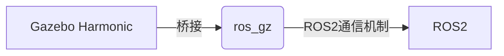

# 6.兼容仿真工具-Gazebo

> **⚠️ Jazzy 版本适配提示**
>
> ROS 2 **Jazzy** 默认搭配 **Gazebo Harmonic（新版 Gazebo）**，与 Humble 使用的“经典 Gazebo 11（`gazebo_ros_pkgs`）”不同。本 Jazzy 分支已做如下适配：
> - 安装包改为 `ros-jazzy-ros-gz`（集成 Gazebo Harmonic 与 ROS 2 桥接）。
> - 启动命令由 `gazebo` 改为 `gz sim`；通过 ROS 2 启动用 `ros2 launch ros_gz_sim ...`。
> - 原 `libgazebo_ros_*.so` 等经典插件为经典 Gazebo 专用，Harmonic 下改用 `ros_gz` 桥接（第 9 章各小节已给出具体写法）。
> - 本章（及第 9 章 Gazebo 相关小节）已按 Harmonic 改写命令；个别插件/桥接细节建议在 Jazzy+Harmonic 实机验证，参考 [Gazebo Harmonic 文档](https://gazebosim.org/docs/harmonic/) 与 [ros_gz](https://github.com/gazebosim/ros_gz)。

今天说说Gazebo，有些同学没有学习RVIZ和Gazebo之前，分不清Gazebo和Rviz之间的区别，只道是Gazebo和RVIZ都能显示机器人模型。

## 1.Gazebo VS Rviz2

昨天小鱼有说RVIZ2是什么：

文章中讲道**RVIZ2是用来可视化数据的软件，核心要义是将数据展示出来（我们不生产数据只做数据的搬运工）。
而Gazebo是用于模拟真实环境生产数据的（我们不搬运数据只做数据的生产者）**

所以Gazebo可以根据我们所提供的机器人模型文件，传感器配置参数，给机器人创造一个虚拟的环境，虚拟的电机和虚拟的传感器，并通过ROS/ROS2的相关功能包把传感器数据电机数据等发送出来（生产数据）。

这样我们就不用花一分钱，就拥有了各式各样的机器人和传感器（一万八的雷达，也只不过是用鼠标拖拽一下）。

## 2.Gazebo集成ROS2

**Gazebo 是一个独立的应用程序，可以独立于 ROS 或 ROS 2 使用。** 

在 ROS 2 **Jazzy** 中，Gazebo 默认是 **Gazebo Harmonic（新版 Gazebo）**，它与 ROS 2 的集成通过一组叫做 `ros_gz` 的包完成（经典 Gazebo 11 的 `gazebo_ros_pkgs` 在 Harmonic 下已不存在）。`ros_gz` 把 Gazebo 的仿真/传感器数据和 ROS 2 话题双向桥接起来。



### 2.1 ros_gz

`ros_gz` 不是单一包，是一组包：

- ros_gz_sim：启动 Gazebo Harmonic 并把 URDF/SDF 模型加载进仿真
- ros_gz_bridge：在 Gazebo 话题与 ROS 2 话题之间做双向桥接（如雷达、IMU、图像等）
- ros_gz_image / ros_gz_point_cloud：图像、点云相关的桥接
- ros_gz_interfaces：桥接用到的接口定义

> 传感器（雷达/IMU 等）在 Harmonic 下一般不用 `gazebo_ros` 插件，而是用 Gazebo 自带 sensor，再通过 `ros_gz_bridge` 桥接到 ROS 2。具体写法见第 9 章。
> 参考：https://github.com/gazebosim/ros_gz

## 3. 两轮差速小demo

### 3.1安装gazebo

因为安装ROS2不会默认安装gazebo，所以我们要手动安装,一行命令很简单，如果提示找不到先去更新下ROS2的源。


```shell
sudo apt install gz-harmonic
```

### 3.2 安装ROS2的两轮差速功能包

一行代码全给装了，不差这点空间

```shell
sudo apt install ros-jazzy-ros-gz-*
```

### 3.3 运行两轮差速demo

一行代码搞定

```shell
gz sim
```

> 说明：经典 Gazebo 的 `gazebo_ros_diff_drive_demo.world` 在 Harmonic 下不存在。想体验官方两轮差速 demo，可安装 `sudo apt install ros-jazzy-ros-gz-sim-demos` 后查看其 launch 文件（如 `ros2 launch ros_gz_sim_demos diff_drive_demo.launch.py`，以实际包内容为准）。

然后你就可以看到一个死丑死丑的小车


### 3.4 查看话题

通过下面的指令可看到话题和话题的类型，把目光放到这个话题`/demo/cmd_demo`,下面我们就通过这个话题来控制小车动起来。

```shell
ros2@ros2-TM1613R:~$ ros2 topic list -t
/clock [rosgraph_msgs/msg/Clock]
/demo/cmd_demo [geometry_msgs/msg/Twist]
/demo/odom_demo [nav_msgs/msg/Odometry]
/parameter_events [rcl_interfaces/msg/ParameterEvent]
/rosout [rcl_interfaces/msg/Log]
/tf [tf2_msgs/msg/TFMessage]
```

### 3.5 让小车前进

```shell
ros2 topic pub /demo/cmd_demo geometry_msgs/msg/Twist "{linear: {x: 0.2,y: 0,z: 0},angular: {x: 0,y: 0,z: 0}}"
```

然后就可以看到小车动了起来。


## 4.总结

- RVIZ2是用来可视化数据的软件，核心要义是将数据展示出来（我们不生产数据只做数据的搬运工）
- Gazebo是用于模拟真实环境生产数据的（我们不搬运数据只做数据的生产者)
- Gazebo是独立于ROS/ROS2的软件（还有很多仿真软件可以用ROS/ROS2）
- ROS2和Gazebo Harmonic之间的桥梁是：ros_gz（ros_gz_bridge）


--------------

技术交流&&问题求助：

- **微信公众号及交流群：鱼香ROS**
- **小鱼微信：AiIotRobot**
- **QQ交流群：139707339**

- 版权保护：已加入“维权骑士”（rightknights.com）的版权保护计划