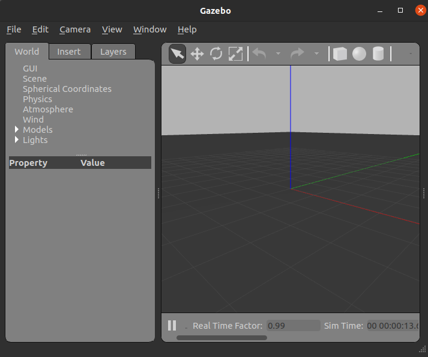
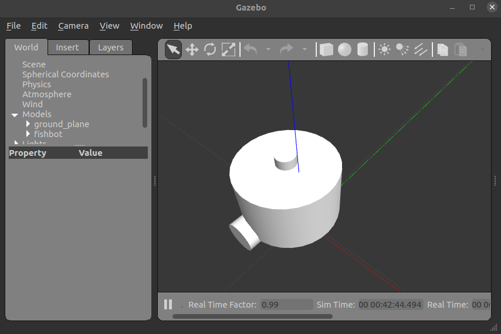
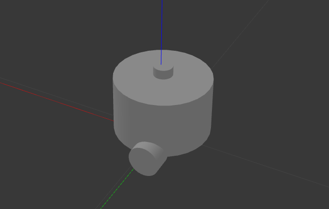

# 3.使用gazebo加载URDF

> **⚠️ Jazzy 版本适配提示**
>
> ROS 2 **Jazzy** 默认搭配 **Gazebo Harmonic（新版 Gazebo）**，与 Humble 使用的“经典 Gazebo 11（`gazebo_ros_pkgs`）”不同。本章已按 Harmonic 改写：
> - 安装包：`ros-jazzy-ros-gz`（集成 Gazebo Harmonic 与 ROS 2 桥接）。
> - 启动仿真：`ros2 launch ros_gz_sim gz_sim.launch.py gz_args:="empty.sdf -r"`。
> - 加载机器人：`ros2 run ros_gz_sim create -name fishbot -file <urdf路径>`（代替经典 `gazebo_ros` 的 `spawn_entity.py`）。
> - ROS 2 与 Gazebo 之间通过 `ros_gz_bridge` 桥接，经典 Gazebo 的 `/spawn_entity` 服务在 Harmonic 下已不存在。
> 下面命令均按 Harmonic 写法给出；若个别参数在你的环境有差异，请以官方 [Gazebo Harmonic 文档](https://gazebosim.org/docs/harmonic/) 与 [ros_gz](https://github.com/gazebosim/ros_gz) 为准。

## 1.Gazebo-ROS2桥接介绍

在第六章中小鱼曾介绍过，Gazebo 是独立于 ROS/ROS2 之外的仿真软件，我们可以独立使用 Gazebo。如果我们想要通过 ROS 2 和 Gazebo 进行交互，在 Harmonic 下是通过 `ros_gz` 桥接（而不是 Humble 的 `gazebo_ros` 插件）来实现的。

接下来小鱼先带你通过命令行的形式启动 Gazebo Harmonic，并把 fishbot 的 URDF 模型加载到 Gazebo 中。

### 1.1 安装Gazebo相关功能包

```shell
sudo apt install ros-jazzy-ros-gz
```

> 该元包会同时安装 Gazebo Harmonic 本体与 `ros_gz_sim`、`ros_gz_bridge` 等 ROS 2 集成包。

### 1.2 启动Gazebo

安装完成后，我们就可以通过下面的命令行来启动 Gazebo Harmonic，并自动加载 ROS 2 桥接。

```shell
ros2 launch ros_gz_sim gz_sim.launch.py gz_args:="empty.sdf -r"
```

> 说明：`gz_args:="empty.sdf -r"` 表示加载 Gazebo 自带的 `empty.sdf` 空世界，并在仿真启动后自动开始（`-r` = run）。你也可以换成自己的世界文件，例如 `gz_args:="my_world.sdf -r"`。
> 如果只想单独启动 Gazebo 图形界面（不接入 ROS 2），可以直接执行 `gz sim empty.sdf -r`。

看到 Gazebo 窗口正常弹出，即代表启动成功（Gazebo Harmonic 的窗口标题为 **Gazebo Sim**，不再是经典 Gazebo 11）。




## 2.节点与话题介绍

使用 1.2 中的指令启动 Gazebo 后，我们用下面的指令来看一下有哪些 ROS 2 节点在运行：

```shell
ros2 node list
```

在 Harmonic 下，Gazebo 与 ROS 2 之间的桥接节点一般是：

```
/ros_gz_sim
```

以及你后面会启动的 `/robot_state_publisher` 等。

在经典 Gazebo 中我们常用 `/spawn_entity` 服务来加载模型；**在 Harmonic 下这个服务已经不存在了**，取而代之的是 `ros_gz_sim` 提供的 `create` 节点（命令行工具），我们直接用它来把机器人加载进 Gazebo。

## 3.加载fishbot到Gazebo

先把 fishbot 的 URDF 模型文件路径准备好。假设你的功能包 `fishbot_description` 里放好了 `urdf/fishbot_gazebo.urdf`，可以用下面命令拿到它的绝对路径：

```shell
echo $(ros2 pkg prefix fishbot_description)/share/fishbot_description/urdf/fishbot_gazebo.urdf
```

然后执行 `create` 节点把机器人生成到 Gazebo 中：

```shell
ros2 run ros_gz_sim create \
  -name fishbot \
  -file $(ros2 pkg prefix fishbot_description)/share/fishbot_description/urdf/fishbot_gazebo.urdf
```

> 提示：不同版本的 `ros_gz_sim create` 参数名可能为 `-name` 或 `-entity`，如果你的环境提示参数错误，可把 `-name` 换成 `-entity` 再试。
> 想让机器人在指定位置出生，可加 `-x 1 -y 0 -z 0`（x/y/z 平移）或 `-R 0 -P 0 -Y 1.57`（roll/pitch/yaw 旋转）。

看到返回类似 `Entity spawned` 的提示，再看 Gazebo 窗口，一个小小的、白白的机器人就出现了。

按住 Shift 加鼠标左键拖动，可以好好欣赏一下我们的机器人。



### 3.4 在不同位置加载多个机器人

想要多机器人仿真时，只要给每个机器人不同的 `-name` 和出生位置即可，例如：

```shell
ros2 run ros_gz_sim create \
  -name fishbot_0 \
  -x 1 -y 0 -z 0 \
  -file $(ros2 pkg prefix fishbot_description)/share/fishbot_description/urdf/fishbot_gazebo.urdf
```

### 3.5 查询和删除机器人

在 Harmonic 下，实体管理走的是 Gazebo 自己的服务（如 `/world/<world>/create`、`/world/<world>/remove`），与经典 Gazebo 的 `/spawn_entity`、`/delete_entity` 不同。

- **查询**：直接看 Gazebo 界面左侧的 World 树。
- **删除**：在 Gazebo 界面里选中实体后按 Delete，或调用 Gazebo 的 `/world/empty/remove` 服务。

例如删除上面生成的 `fishbot_0`：

```shell
ros2 service call /world/empty/remove gz.msgs.Entity 'name: "fishbot_0"'
```

> 注：`gz.msgs.Entity` 是 Gazebo 自己的消息类型；若你的环境服务名/类型略有差异，请用 `ros2 service list | grep remove` 自行核对。


## 4. 将启动gazebo和生产fishbot写成launch文件

打开fishbot工作空间，在`src/fishbot_description/launch`中添加一个`gazebo.launch.py`文件，我们开始编写launch文件来在gazebo中加载机器人模型。

启动 Gazebo，我们可以把命令行写成一个 launch 的 `IncludeLaunchDescription`；生成机器人则用 `ros_gz_sim` 的 `create` 节点。

```python
import os
from launch import LaunchDescription
from launch.actions import IncludeLaunchDescription
from launch.launch_description_sources import PythonLaunchDescriptionSource
from launch_ros.actions import Node
from ament_index_python.packages import get_package_share_directory


def generate_launch_description():
    robot_name_in_model = 'fishbot'
    package_name = 'fishbot_description'
    urdf_name = "fishbot_gazebo.urdf"

    ld = LaunchDescription()
    pkg_share = get_package_share_directory(package_name)
    urdf_model_path = os.path.join(pkg_share, f'urdf/{urdf_name}')

    # 启动 Gazebo Harmonic（含 ROS 2 桥接）
    start_gazebo_cmd = IncludeLaunchDescription(
        PythonLaunchDescriptionSource(
            os.path.join(
                get_package_share_directory('ros_gz_sim'),
                'launch',
                'gz_sim.launch.py')),
        launch_arguments={'gz_args': 'empty.sdf -r'}.items()
    )

    # 把机器人模型加载进 Gazebo
    spawn_entity_cmd = Node(
        package='ros_gz_sim',
        executable='create',
        arguments=['-name', robot_name_in_model, '-file', urdf_model_path],
        output='screen')

    ld.add_action(start_gazebo_cmd)
    ld.add_action(spawn_entity_cmd)

    return ld
```

编译运行

```
colcon build --packages-select fishbot_description
source install/setup.bash
ros2 launch fishbot_description gazebo.launch.py
```

 完美显示



## 5.总结

这节课我们为Fishbot注入了仿真必须的物理属性，但是机器人还是不会动，下一节课我们就利用Gazebo的其他插件，让我们的机器人动起来。

最后再留一个课后作业：

1. 尝试将fishbot的物理属性去掉，再加载机器人看看会发生什么？

2. 尝试将fishbot的碰撞改成很小，再看看会发生什么？

3. gazebo还支持link的材料修改，在URDF中添加下面的代码，给支撑轮一个不一样的材质吧，你也可以将reference改成其他link，装点一下你的机器人。

   ```xml
     <gazebo reference="caster_link">
       <material>Gazebo/Black</material>
     </gazebo>
   ```

> 注意：`Gazebo/Black` 等材质名是经典 Gazebo 的写法；在 Harmonic 下材质颜色请用 `<visual><material><color rgba="..."/></material></visual>` 等方式设置，或参考 [Harmonic 材质文档](https://gazebosim.org/docs/harmonic/materials)。

欢迎将你的实验结果在我们的[fishros社区分享](https://fishros.org.cn/forum/)~


--------------

技术交流&&问题求助：

- **微信公众号及交流群：鱼香ROS**
- **小鱼微信：AiIotRobot**
- **QQ交流群：139707339**

- 版权保护：已加入“维权骑士”（rightknights.com）的版权保护计划
